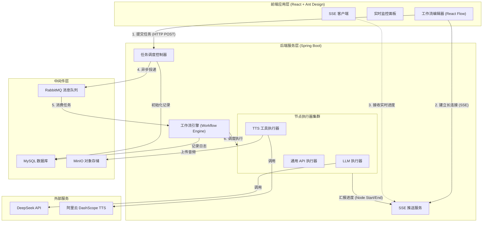
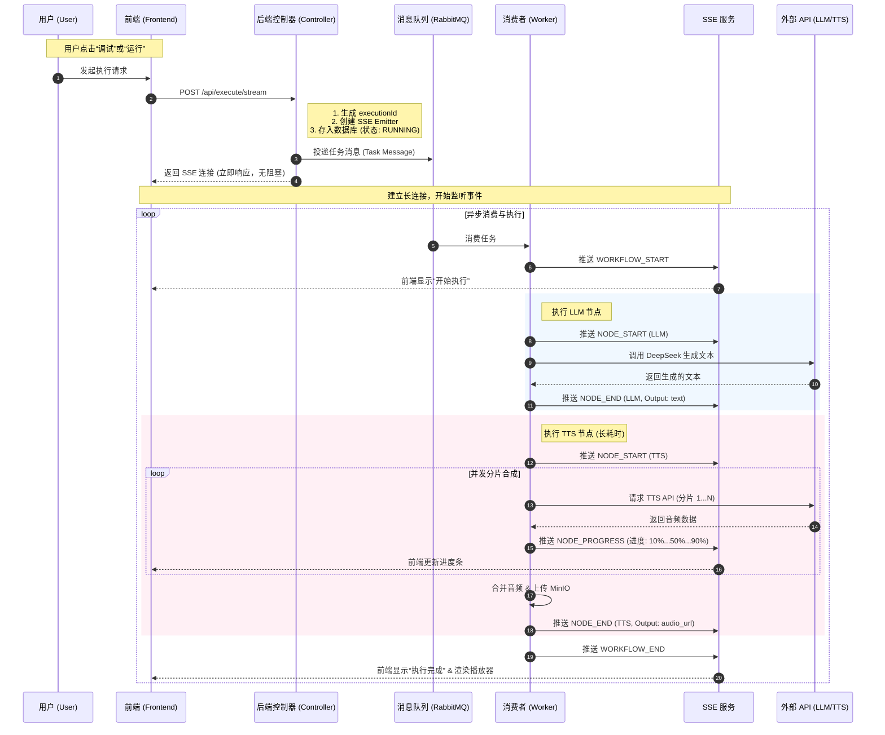

# OfficeAgent

OfficeAgent 是一个企业级、可视化的 AI 工作流编排系统。它通过拖拽式低代码界面，允许用户将大语言模型 (LLM)、外部工具 (如语音合成 TTS)、API 调用等能力串联成复杂的工作流，以实现多模态、长链路的自动化任务处理。

针对长文本生成语音等耗时场景，OfficeAgent 创新性地采用了 **RabbitMQ + SSE (Server-Sent Events)** 的全异步架构，彻底解决了传统同步 HTTP 请求超时的问题，支持长达数十分钟的任务稳定执行与实时进度反馈。

---

## 🏗 系统架构 

OfficeAgent 采用微服务化架构设计，前后端分离，核心组件包括工作流引擎、节点执行器、异步任务队列和实时推送服务。



---

## ⚡ 异步执行流程 

针对长耗时任务（如生成 5000 字长文并转语音），系统采用全异步处理流程，确保前端零超时。



---

## 🚀 核心特性 

### 1. 可视化工作流编排
*   基于 **React Flow** 构建的画布，支持节点的自由拖拽、缩放和连接。
*   内置多种节点类型：
    *   **Input**: 定义用户输入变量。
    *   **LLM**: 集成 DeepSeek、Qwen 等大模型，支持 Prompt 模板和变量引用。
    *   **Tool**: 集成外部工具，核心支持 **超拟人语音合成 (TTS)**，支持多种音色（Cherry, Serena 等）。
    *   **Output**: 定义工作流最终输出。

### 2. 高性能异步引擎
*   **RabbitMQ 解耦**: 任务提交与执行分离，支持高并发任务堆积。
*   **SSE 实时推送**: 相比 WebSocket 更轻量，单向推送节点状态、执行日志和进度百分比。
*   **并发 TTS 合成**: 将长文本智能切分为多个短句，利用 `CompletableFuture` 并行调用 TTS 接口，合成速度提升 5-10 倍。

### 3. 稳健的容错机制
*   **全局超时控制**: 支持配置长达 10 分钟以上的任务执行时间。
*   **分片容错**: 单个音频分片合成失败自动跳过或重试，不影响整体任务。
*   **断点续传 (计划中)**: 记录每个节点的执行状态，失败后可从断点处恢复。

---

## 🛠 技术栈 

| 领域 | 技术/框架 | 说明 |
| :--- | :--- | :--- |
| **后端** | Spring Boot 3.4.1 | 核心业务逻辑框架 |
| | RabbitMQ | 异步消息队列中间件 |
| | Spring AI | 统一 AI 接口调用层 |
| | MyBatis-Plus | 数据库 ORM 框架 |
| | DashScope SDK | 阿里云百炼大模型 SDK |
| **前端** | React 18 + Vite | 现代化前端构建 |
| | React Flow | 流程图/工作流引擎库 |
| | Ant Design | 企业级 UI 组件库 |
| | Fetch API | 原生支持 SSE 流式读取 |
| **数据存储** | MySQL 8.0 | 关系型数据存储 |
| | MinIO | 对象存储 (音频/文件) |

---

## 📂 项目结构

```text
OfficeAgent/
├── backend/                  # 后端工程 (Spring Boot)
│   ├── src/main/java/com/officeagent/
│   │   ├── config/           # 配置类 (RabbitMQ, WebConfig)
│   │   ├── controller/       # 控制器 (ExecutionController)
│   │   ├── engine/           # 工作流引擎核心
│   │   │   ├── core/         # 核心执行逻辑 (WorkflowExecutor, Consumer)
│   │   │   ├── model/        # 图模型 (Graph, Node, Edge)
│   │   │   └── node/         # 节点执行器实现 (LLM, Tool)
│   │   ├── service/          # 业务服务 (SSE, Log)
│   │   └── utils/            # 工具类 (MinIO)
│   └── src/main/resources/   # 配置文件 (application.yml)
│
├── frontend/                 # 前端工程 (React)
│   ├── src/
│   │   ├── components/       # UI 组件 (Sidebar, VisualLog)
│   │   │   └── nodes/        # 自定义节点组件 (LLMNode, ToolNode)
│   │   ├── pages/            # 页面 (WorkflowEditor)
│   │   └── utils/            # 工具函数 (API Client)
│   └── public/               # 静态资源
│
└── docs/                     # 项目文档
    ├── diagrams/             # 架构图源文件
    ├── UserManual.md         # 用户手册
    └── DesignDocument.md     # 设计文档
```

---

## ⚙️ 配置指南

修改 `backend/src/main/resources/application.yml`：

| 配置项 | 默认值 | 说明 |
| :--- | :--- | :--- |
| `server.port` | 8081 | 后端服务端口 |
| `spring.rabbitmq.host` | localhost | RabbitMQ 地址 |
| `spring.rabbitmq.port` | 5672 | RabbitMQ 端口 |
| `spring.datasource.url` | jdbc:mysql://... | 数据库连接串 |
| `spring.ai.openai.api-key` | (需配置) | 默认 OpenAI/DeepSeek Key |
| `minio.endpoint` | (可选) | MinIO 地址 |

---

## 📦 快速启动

1.  **启动中间件**：确保 MySQL 和 RabbitMQ 已启动。
2.  **启动后端**：
    ```bash
    cd backend
    ./mvnw spring-boot:run
    ```
3.  **启动前端**：
    ```bash
    cd frontend
    npm install
    npm run dev
    ```
4.  访问 `http://localhost:5173` 开始使用。
