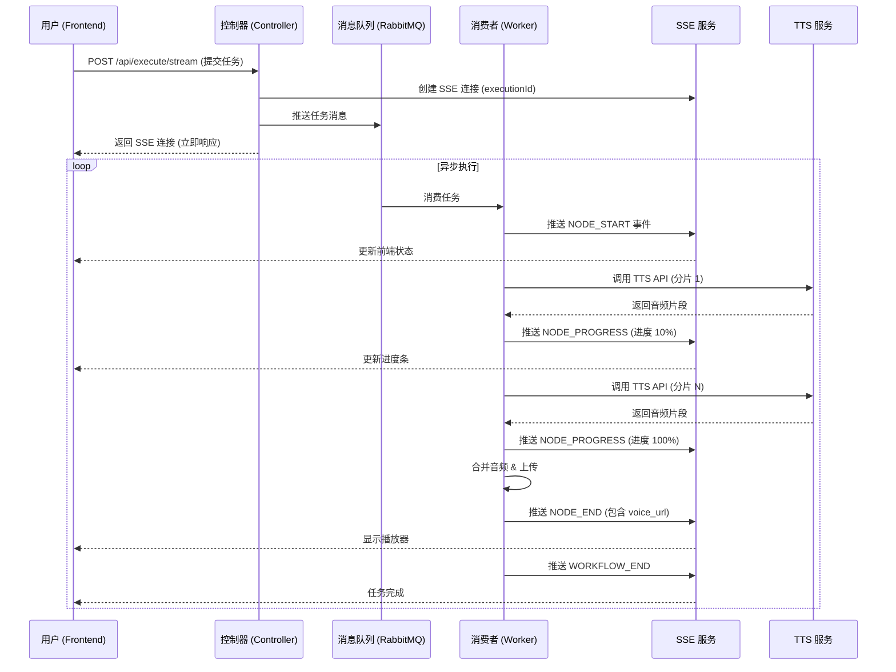

# OfficeAgent 系统设计文档 (Design Document)

## 1. 系统架构

OfficeAgent 采用前后端分离的微服务架构设计，基于 Spring Boot 和 RabbitMQ 构建了高可用、可扩展的异步任务处理平台。

### 1.1 总体架构图 (Mermaid)

```mermaid
graph TD
    User[用户] --> Frontend[前端 (React + Ant Design)]
    Frontend -- HTTP/SSE --> Backend[后端 (Spring Boot)]
    Backend -- 任务提交 --> RabbitMQ[RabbitMQ 消息队列]
    Backend -- 数据存储 --> MySQL[MySQL 数据库]
    Backend -- 音频存储 --> MinIO[MinIO / 本地存储]
    RabbitMQ -- 消费任务 --> Worker[异步消费者 (WorkflowExecutionConsumer)]
    Worker -- 调用 --> LLM[大模型 API (DeepSeek/Qwen)]
    Worker -- 调用 --> TTS[语音合成 API (DashScope)]
    Worker -- 实时进度 --> SSE[SSE 推送服务]
    SSE -- 推送事件 --> Frontend
```

### 1.2 核心模块

1.  **Workflow Engine (工作流引擎)**
    *   负责解析前端传递的 JSON 图结构 (Graph)。
    *   管理节点执行顺序 (拓扑排序)。
    *   处理数据流转 (Context 传递)。

2.  **Node Executors (节点执行器)**
    *   **LLMNodeExecutor**: 封装大模型调用逻辑，支持变量替换和流式输出。
    *   **ToolNodeExecutor**: 封装外部工具调用，目前核心功能为 TTS (文本转语音)。支持长文本分片、并发合成、断点续传。
    *   **Input/OutputNodeExecutor**: 处理输入输出数据的格式化与校验。

3.  **Async Task System (异步任务系统)**
    *   基于 RabbitMQ 实现任务解耦。
    *   **Producer**: `ExecutionController` 接收请求，生成 `executionId`，将任务推送到队列。
    *   **Consumer**: `WorkflowExecutionConsumer` 监听队列，执行具体业务逻辑。
    *   **SSE Service**: `SseEmitterService` 管理长连接，实现进度的实时反向推送。

## 2. 异步执行流程详解

为了解决长文本语音合成 (TTS) 导致的 HTTP 超时问题，OfficeAgent 设计了一套完整的异步执行机制。

### 2.1 时序图 (Sequence Diagram)



### 2.2 关键设计点

*   **超时控制**：
    *   HTTP (SSE) 连接超时：10 分钟 (600s)。
    *   TTS 内部并发超时：10 分钟 (600s)。
    *   RabbitMQ 消息 TTL：默认持久化，无过期时间。

*   **TTS 分片策略**：
    *   **一级切分**：按标点符号 (`。！？`) 切分句子。
    *   **二级切分**：对超过 100 字符的长句按逗号 (`,，`) 再次切分。
    *   **并发执行**：使用 `CompletableFuture` 并行请求阿里云 TTS 接口，显著提升合成速度。
    *   **容错处理**：单个分片失败不影响整体，返回空字节并记录日志。

## 3. 数据模型

### 3.1 ExecutionLog (执行日志)
| 字段名 | 类型 | 描述 |
| :--- | :--- | :--- |
| id | Long | 主键 |
| status | String | 状态 (RUNNING, SUCCESS, FAILED) |
| input_data | Text | 输入参数 JSON |
| output_data | Text | 输出结果 JSON |
| execution_details | Text | 错误详情或执行步骤 |
| start_time | DateTime | 开始时间 |
| end_time | DateTime | 结束时间 |

### 3.2 Graph (图结构)
```json
{
  "nodes": [
    { "id": "1", "type": "input", "data": { ... } },
    { "id": "2", "type": "llm", "data": { ... } }
  ],
  "edges": [
    { "source": "1", "target": "2", "id": "e1-2" }
  ]
}
```

## 4. 技术选型理由

*   **Spring Boot**: 成熟的 Java 生态，便于集成 AI 和消息队列组件。
*   **RabbitMQ**: 高可靠的消息中间件，支持持久化和确认机制，适合任务调度。
*   **React Flow**: 业界领先的 React 流程图库，交互体验优秀，扩展性强。
*   **SSE (Server-Sent Events)**: 相比 WebSocket 更轻量，适合单向的服务端进度推送场景。
*   **DashScope SDK**: 阿里云官方 SDK，提供高质量的 CosyVoice 语音合成服务。
